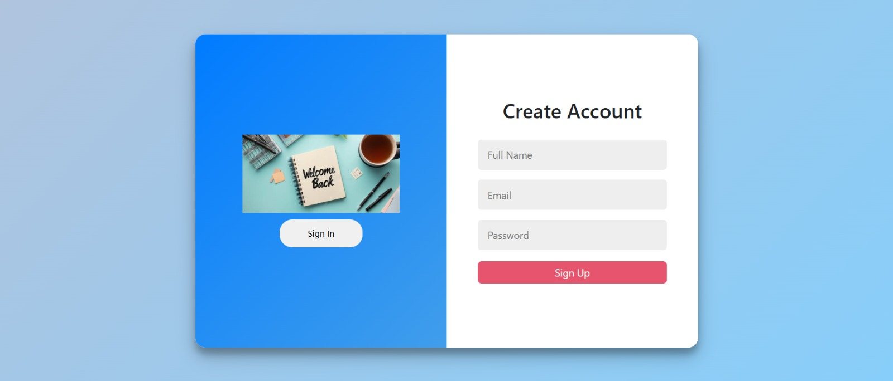
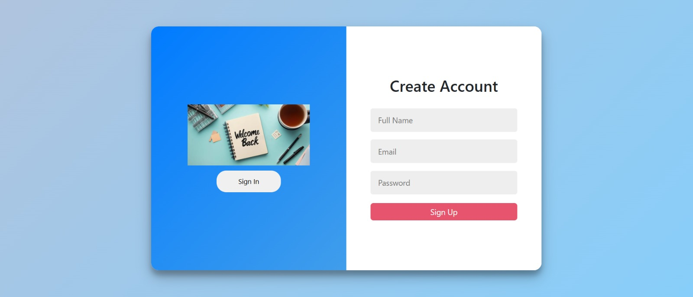

# 🔐 Modern Login & Signup Interface

A sleek and interactive authentication page built with HTML and CSS. This project showcases a stylish and mobile-friendly design for login and registration functionality, perfect for integrating into any modern web application.

## ✨ Highlights

- 🔄 Smooth sliding panels for login and registration
- 💎 Elegant, UI design
- 🖥️ Fully responsive across all devices
- 🎨 Clean layout with subtle animations
- 🧩 Easily customizable and extendable

## 🧰 Built With

- HTML5 (Semantic Structure)
- CSS3 (Flexbox, Media Queries, Transitions)

## 📸 Screenshots

## The Login Page:

## The Signup Page:

## 📌 Use Case

Ideal for personal projects, portfolios, SaaS platforms, or any web app requiring user authentication with a modern feel.

## 🚀 Get Started

Simply open `index.html` in your browser and enjoy the experience!

